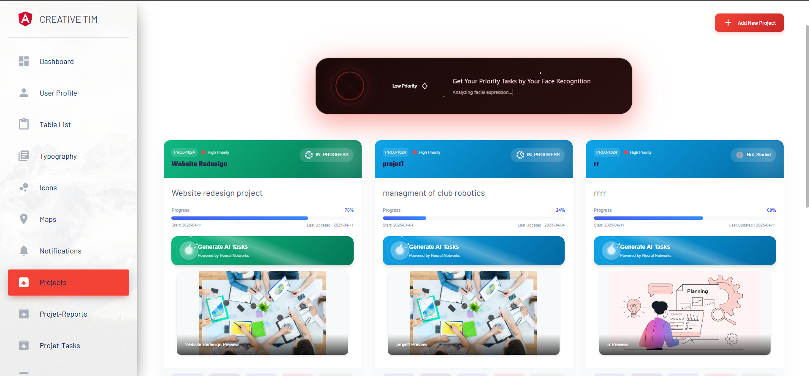

# ✨ Gestion Projet - Task Management System  

*A modern project tool with task tracking, reporting, and team collaboration for seamless club management.*  

<div align="center">
  
</div>

---

## 🚀 Features  
### 📌 **Task Management**  
- ✅ Create, assign, and track tasks with deadlines  
- 🔍 Filter by status (`To-Do` / `In Progress` / `Done`)  
- 🚨 Priority labels (**High**/Medium/Low)  

### 📊 **Reporting**  
- 📄 Generate PDF/Excel reports with one click  
- 📈 Interactive dashboard with completion analytics  
- 🏆 Team performance insights  

### 💬 **Messaging**  
- 💬 Notifications for task updates  
- 🧵 Comment threads on tasks  

---

## ⚙️ Tech Stack  
**Frontend**:  
<p align="left">
  
  
  
</p>

**Backend**:  
<p align="left">
  
  
  
</p>

**Tools**:  
<p align="left">
  
  
</p>

---

## 🛠️ Installation  

### **Prerequisites**  
- Node.js (for Angular)  
- Java 17+  
- PostgreSQL  

### **Backend Setup**  
```sh
git clone https://github.com/Harounjlassi/ClubSync_PI_4Arctic2.git
cd gestion-projet/backend
mvn spring-boot:run